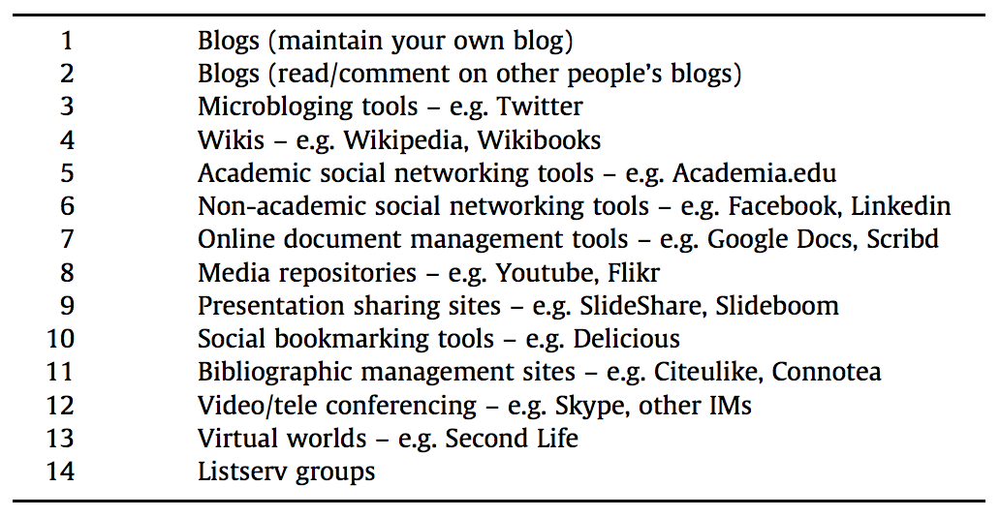
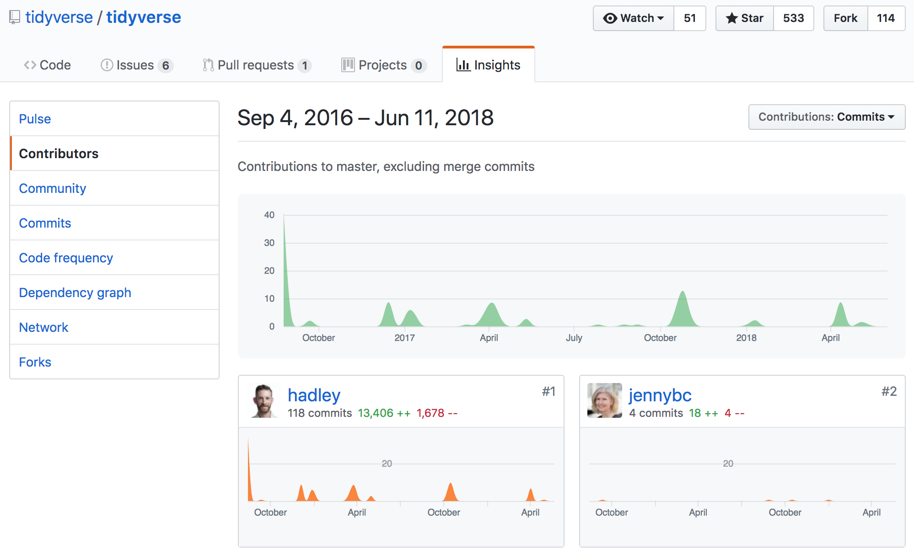
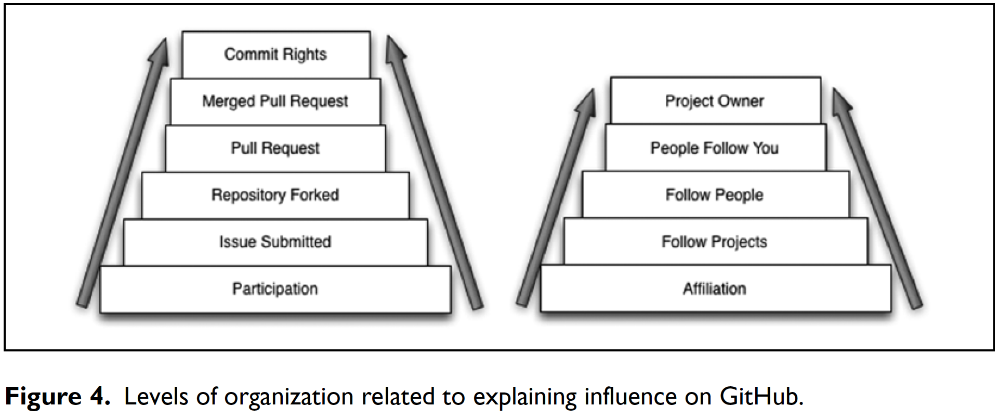
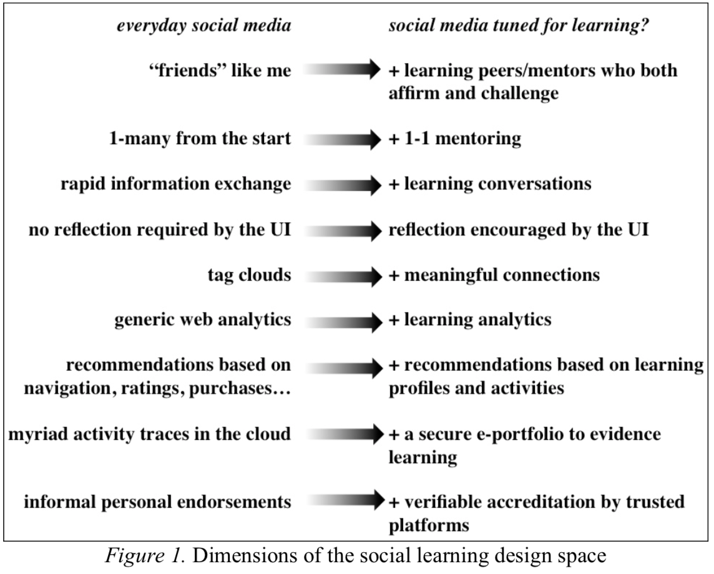
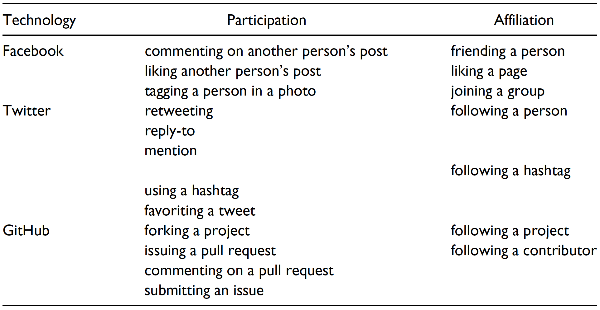
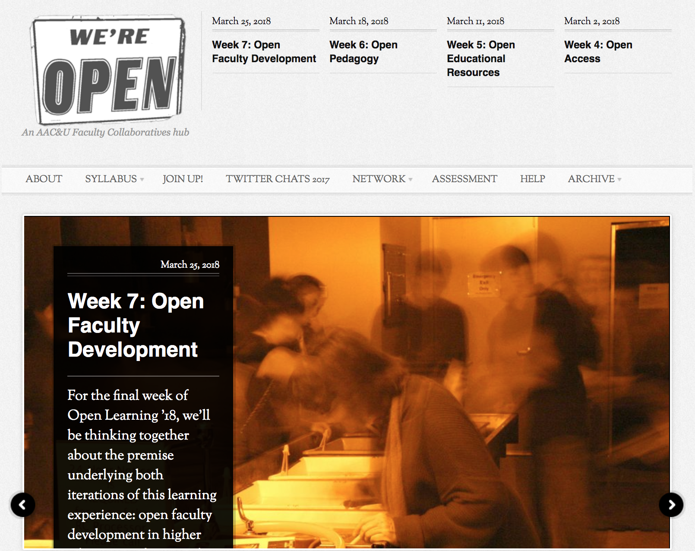
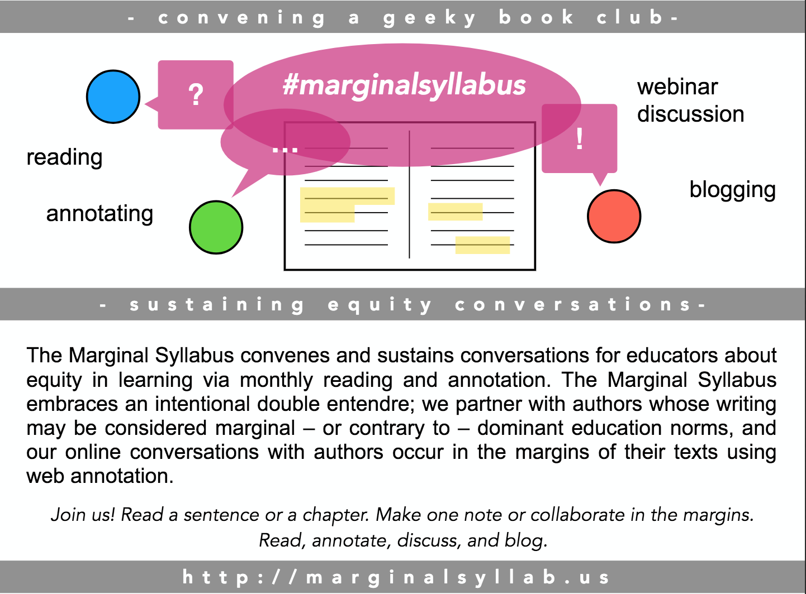
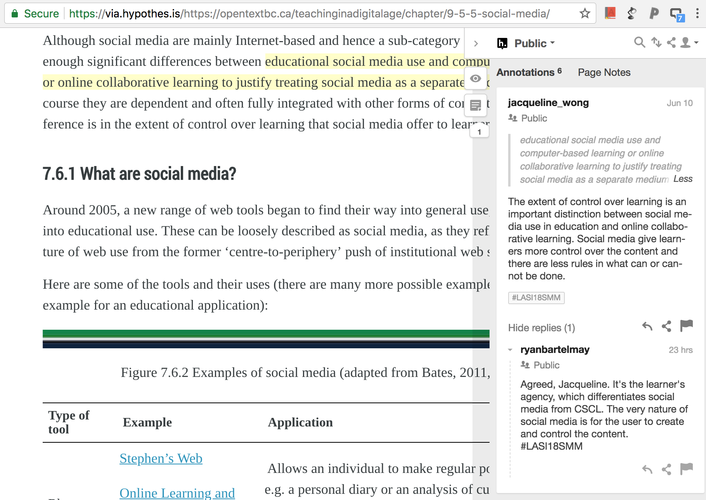

```{r setup, include=FALSE}
options(htmltools.dir.version = FALSE)
```

background-image: url(https://solaresearch.org/wp-content/uploads/2014/06/cropped-solar-logo1.png)

???

Image credit: [Wikimedia Commons](https://commons.wikimedia.org/wiki/File:Sharingan_triple.svg)

---

# About Me

Assistant Professor in learning technologies  
University of Minnesota

- Collaborative learning
- Learning analytics
- MOOCs

---

Acknowledgements
====

I do not own the copyright of any of the images in this presentation. I therefore acknowledge the original copyright. Other content in this presentation (e.g., text and code) is licensed under the [Attribution 4.0 International (CC BY 4.0) License](https://creativecommons.org/licenses/by/4.0/).


<!--  -->

## Disclaimer

Work included in this presentation is produced for teaching purposes only and is hereby not intended for generalizable scholarly knowledge.

---

Housekeeping
========================================================

- **Github repository**: http://bit.ly/lasi18smm
  - `git clone` or `Download ZIP`
- **Twitter hashtag**: #LASI18smm


Feel free to ask questions ANYTIME!

---

Prep
====

### Install

1. [R](https://cran.r-project.org/)
2. [RStudio development environment](https://www.rstudio.com/)
3. R packages: ([How?](http://www.dummies.com/programming/r/how-to-install-load-and-unload-packages-in-r/))
  - `install.packages(c("tidyverse", "igraph", "GGally", "httr", "jsonlite", "RCurl", "stringr"))`

<!-- ### Alternative -->

<!-- - CoLaboratory (check whether R works) -->
<!-- - Watson Studio -->

---

Tentative Agenda
====

1. Social media basics
2. Social media for learning  
(Short Break)  
3. Collecting social media data
4. Mining social media data

---
class: inverse, middle, center

# Part 1: Social Media Basics


---

What are social media?
====

1. Pair & Share  
(self-intro)
2. Tweet out your definition(s) -- [#LASI18smm](https://twitter.com/search?q=%23LASI18smm&src=typd)


---

# What do social media researchers say?

Gruzd, Staves, & Wilk 2012:



<!-- Examples of social media include social network sites (e.g., Facebook); wikis (e.g., wikispaces); media-sharing services (e.g., YouTube); blogging tools (e.g., Blogger); micro-blogging services (e.g., Twitter); social bookmarking (e.g., Delicious); bibliographic management tools (e.g., Zotero); and presentation-sharing tools (e.g., Slideshare). -->

---

What do social media researchers say?
====

Obar & Wildman, 2015:

1. Social media services are (currently) Web 2.0 Internet-based applications
2. User-generated content is the lifeblood of social media
3. Individuals and groups create user-specific profiles for a site or app designed and maintained by a social media service
4. Social media services facilitate the development of social networks online by connecting a profile with those of other individuals and/or groups

---

# Example: Twitter


---

# Example: Twitter


(Goggins & Petakovic, 2014)

---

# Example: Github


---

# Example: Github



---

# Example: Github



(Goggins & Petakovic, 2014)

---
class: inverse, middle, center

# Part 2: Social Media for Learning

AND  
Learning on Social Media

---
class: middle


# Pair & Share

- What educational use of social media you're involved/interested in?
- How is *learning* conceptualized in the context?

---

# Educational Affordances

- connectivity (interconnections)
- interactivity
- information sharing and discovery
- content creation, remixing
- etc.

(Bates; Greenhow; Siemens & Downes)

---

Broadening the Conceptualization & Scope
====

Learner-centered themes

- Learners' participation and creative practices
- Learners' online identity formation

(Greenhow et al., 2009)

---


# Learning attributes on social media

| Category            	| Formal attributes                                 	| Informal attributes                                               	| Social media attributes                                                                           	|
|---------------------	|---------------------------------------------------	|-------------------------------------------------------------------	|---------------------------------------------------------------------------------------------------	|
| Purpose             	| Externally determined 	| Self-determined community of interest                             	| Self-determined; Socially determined                                                               	|
| Process of Learning 	| Teacher-led (didactic)                            	| Self-directed (negotiated); Individual agency                     	| Self-directed; Other- influenced; Unintended network effects                             	|
| Location/context    	| Time-restricted                       	| Open-ended                                         	| Open-ended                                                                                	|
| Content             	| Knowledge acquisition; High status knowledge      	| Everyday practice; Status of knowledge unacknowledged 	| User-generated, Re-mixed; Social construction and distribution, Knowledge as collective agreement 	|

(Adapted from Greenhow & Lewin, 2016)


---

# Social (and Socialized) Learning


<!--  -->

(Buckingham Shum & Ferguson, 2012)

---

# Influence, Participation and Affiliation




(Goggins & Petakovic, 2014)

---

# Context Matters!

Example: [CCK08 cMOOC](https://www.slideshare.net/gsiemens/moocs-educause), Siemens


---

# Example: Open Learning MOOC

http://openlearninghub.net/ (Garnder Campbell)



---

# Example: Open Learning MOOC

[Twitter conversations](https://hawksey.info/tagsexplorer/?key=1HnD3t0x9kSfRiqRvUknHIQDQuxwXjH93eEbo4NsVjFU&gid=400689247)

---

# Example: Connected Learning


<!-- a social MOOC (https://www.futurelearn.com/courses/social-media-analytics?utm_campaign=Share+Links&utm_medium=futurelearn-run_details&utm_source=twitter#section-educators) -->

---

# Example: Connected Learning


[Project Website](http://pbskids.org/scigirls/home)

---

# Example: Personal Learning Networks

\#personalizedpd

<blockquote class="twitter-tweet" data-lang="en"><p lang="en" dir="ltr">Welcome to <a href="https://twitter.com/hashtag/personalizedPD?src=hash&amp;ref_src=twsrc%5Etfw">#personalizedPD</a> Introduce yourself and one word or phrase that has described your school year? <a href="https://twitter.com/hashtag/personalizedPD?src=hash&amp;ref_src=twsrc%5Etfw">#personalizedPD</a> <a href="https://t.co/asgeckhZPL">pic.twitter.com/asgeckhZPL</a></p>&mdash; Heidi Carr (@carr_8) <a href="https://twitter.com/carr_8/status/1004166232080289792?ref_src=twsrc%5Etfw">June 6, 2018</a></blockquote>
<script async src="https://platform.twitter.com/widgets.js" charset="utf-8"></script>

---

# Example: #MarginalSyllabus




<!-- "The Marginal Syllabus convenes and sustains conversations with educators about issues of equity in teaching, learning, and education." -->

<!--  -->


---
<!-- Annotation communities - Climate Feedback -->

# Example: Scholarly Communication


---
class: middle, center

# Open Discussion

---
class: inverse, middle, center

# Part 3: Collecting Social Media Data


---

# Privacy and Ethics

- Research
- Human subjects vs. web documents
- Private vs. public information
- Informed consent
- Data, algorithms, and practices
- ...

---

Case Study 1: #personalizedpd
====

Teacher professional learning community on Twitter

<blockquote class="twitter-tweet" data-lang="en"><p lang="en" dir="ltr">Join me on the <a href="https://twitter.com/hashtag/PersonalizedPD?src=hash&amp;ref_src=twsrc%5Etfw">#PersonalizedPD</a> chat tomorrow for a special discussion on <a href="https://twitter.com/hashtag/MergeCube?src=hash&amp;ref_src=twsrc%5Etfw">#MergeCube</a> resources! <a href="https://twitter.com/hashtag/ARVRinEDU?src=hash&amp;ref_src=twsrc%5Etfw">#ARVRinEDU</a> <a href="https://twitter.com/hashtag/edtech?src=hash&amp;ref_src=twsrc%5Etfw">#edtech</a> <a href="https://twitter.com/MergeVR?ref_src=twsrc%5Etfw">@MergeVR</a> <a href="https://t.co/PIbZPhUqKA">pic.twitter.com/PIbZPhUqKA</a></p>&mdash; Jaime Donally (@JaimeDonally) <a href="https://twitter.com/JaimeDonally/status/988401616058544128?ref_src=twsrc%5Etfw">April 23, 2018</a></blockquote>
<script async src="https://platform.twitter.com/widgets.js" charset="utf-8"></script>

---

# Case 1: #personalizedpd

Blog posts in response to Twitter chats

> At first Twitter allowed me to fill the personalized PD void and connected me with others who both challenged my thinking and inspired me to be a better educator than I was. ...
>
> Then, one glorious day, I found the #personalizedPD chat and my entire perspective changed. Instantly, I loved these people.
>
> -- [Mandy Froehlich](https://mandyfroehlich.com/2016/04/20/i-just-met-you-but-i-love-you/)

---

# Collect Tweets

TAGS
- https://tags.hawksey.info/
- Collect (Twitter API key needed)
- Publish


<!-- - https://mashe.hawksey.info/2011/11/twitter-how-to-archive-event-hashtags-and-visualize-conversation/ -->

---

# Collect Tweets

```{r, eval=FALSE}
# Load helpful functions written by Bodong
source("utils/collect_tweets.R")
source("utils/munge_tweets.R")

# URL to the published sheet
gsheet_url <- "url_link"

# Collect tweets archived in the sheet
tweets_raw <- collect_tweets_from_gdrive(gsheet_url)
```

---

# Clean and store data

```{r, eval=FALSE}
# basic data cleanup (incl. removing duplicates)
tweets <- preprocess_tweets(tweets_raw)

# save cleaned data as a csv file
write_csv(tweets, path = "data/tweets.csv")
```

---

# Case 2: #LASI18smm

Imagine a book club supported by social annotation... Or the #MarginalSyllabus example



---

# API keys


---

Collect Hypothesis Annotations
====

API (aka. Application Programming Interface)

```{r, eval=FALSE}
# Load helpful functions written by Bodong
source("utils/collect_annotations.R")

# Collect annotations
annotations <- collect_annotations(tag = "LASI18smm",
                                   token = h_token,
                                   num = 500)
```

---

Store data
====

```{r, eval=FALSE}
# save data as an Rdata file
save(annotations, file="data/annotations.Rdata")
```

---

Storing data
====

Porpular formats
- CSV (comma-separated vectors)
- JSON
- Relational databses (e.g., MySQL)
- GraphDB (e.g., Neo4j)
- ...

---

Neo4j
====


---

# Troubleshooting?

---
class: inverse, middle, center

# Part 4: Mining Social Media Data

---
class: middle, center

# Mining what?

---
class: middle, center

## Connectivity of a community

## Influence and leadership

## Community evolution

## Cognitive and affective states

## ...

---
class: center, middle

# Demo

### Social network analysis

### Tone analysis

### Keyword extraction + sentiment analysis

---
class: center, middle

# Discussion

## What questions you're wrestling with?

---
class: inverse, middle

# Concluding Remarks

- Consider the context
- Conceptualize learning clearly
- Concentrate on your questions
- Craft a multi-faceted approach

---

# Key References

- Buckingham Shum, S., & Ferguson, R. (2012). [Social learning analytics](https://pdfs.semanticscholar.org/3864/1a9e8445149c9ff7a14e4b587c709fc63a5f.pdf). Educational Technology and Society, 15(3), 3–26. 
- Goggins, S., & Petakovic, E. (2014). [Connecting Theory to Social Technology Platforms](https://doi.org/10.1177/0002764214527093). The American Behavioral Scientist, 58(10), 1376–1392. 
- Greenhow, C., & Lewin, C. (2016). [Social media and education: reconceptualizing the boundaries of formal and informal learning](https://doi.org/10.1080/17439884.2015.1064954). Learning, Media and Technology, 41(1), 6–30. 
- Gruzd, A., Paulin, D., & Haythornthwaite, C. (2016). [Analyzing Social Media And Learning Through Content And Social Network Analysis: A Faceted Methodological Approach](https://doi.org/10.18608/jla.2016.33.4). Journal of Learning Analytics, 3(3), 46–71. 
- Obar, J. A., & Wildman, S. (2015). [Social media definition and the governance challenge: An introduction to the special issue](https://doi.org/10.1016/j.telpol.2015.07.014). Telecommunications Policy, 39(9), 745–750. 
- Siemens, G. (2005). [Connectivism: A learning theory for the digital age](http://er.dut.ac.za/handle/123456789/69). International Journal of Instructional Technology and Distance Learning, 1–8. 

---

# Tool Recommendations

- [Netlytics](https://netlytic.org/)
- [NodeXL](https://nodexl.codeplex.com/)
- [KBDeX](http://www.kbdex.net/)
- [Epistemic Network Analysis](http://www.epistemicnetwork.org/)

---
class: center, middle

# Thank You!


## Contact

chenbd@umn.edu  
@bod0ng  
http://bodong.ch/

